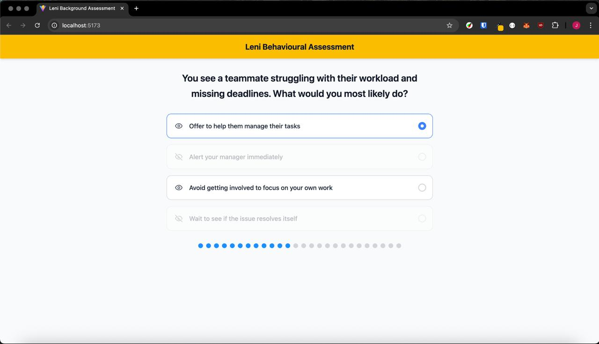

# Behavioural Assessment UI

A static behavioural assessment web page built with **Vite**, **React**, **TypeScript**, and **Tailwind CSS**. This page demonstrates multiple-choice interactions with visibility toggles for better user experience.

---

## Screenshots & Demo

### Desktop UI Preview



### Video Demo

[Watch the Demo Video](./public/Leni-Behavioural-Assessment-Demo.mp4)

> _The video demonstrates the toggling of visibility and selection behaviour._

---

## Tech Stack

-   **React** – Functional Components with Hooks
-   **TypeScript** – Type-safe JavaScript
-   **Tailwind CSS** – Utility-first styling
-   **Vite** – Fast dev server and build tool

---

## Features

-   Eye icon to toggle visibility (using `lucide-react`)
-   Options are disabled when hidden and re-selectable when revealed
-   Visual radio-circle selection indicators

---

## Getting Started

### 1. Clone the Repository

```bash
git clone https://github.com/twhjames/leni-background-assessment.git
cd leni-background-assessment
```

### 2. Install Dependencies

```bash
npm install
```

### 3. Run the Development Server

```bash
npm run dev
```

Visit `http://localhost:5173` to view the app.

---

## Acknowledgements

Built as part of an interface prototype demo to explore enhanced UX for Leni's behavioural assessments.
